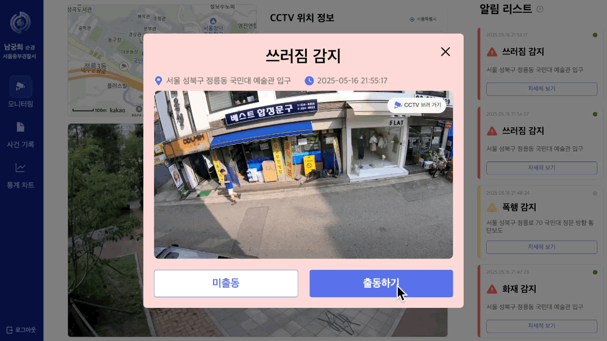
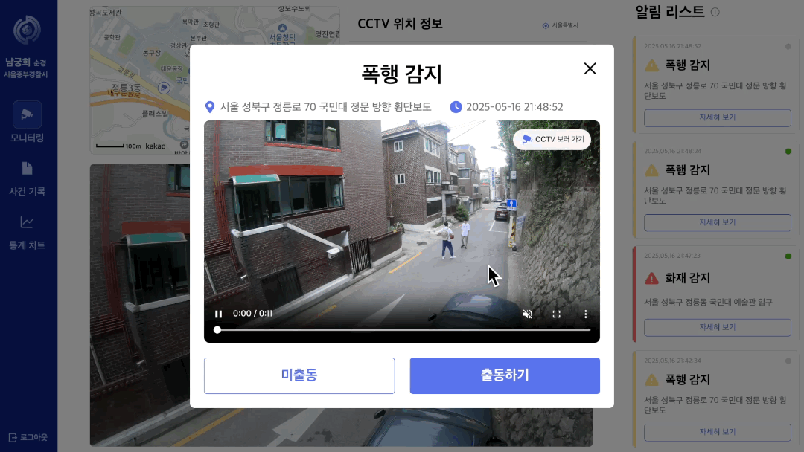

# 👮 순찰의 새로운 방향이 되다, NURINOON

 

  
     
     
    
${\color{#D9D9D9}로고\ 클릭\ 시\ 소개\ 페이지로\ 이동합니다.}$

 
 

## 💡 목차 
1️⃣ [🌐 프로젝트 소개](#-프로젝트-소개)

2️⃣ [🌐 시연 영상](#-시연-영상)

3️⃣ [🌐 소개 영상](#-소개-영상)

4️⃣ [🌐 기능 소개](#-기능-소개)

5️⃣ [🌐 주요 화면](#-주요-화면)

6️⃣ [🌐 시스템 아키텍처](#-시스템-아키텍처)   

7️⃣ [🌐 팀원](#-팀원)  

8️⃣ [🌐 기술 스택](#-기술-스택)  

9️⃣ [🌐 제출 서류](#-제출-서류)

  

## 💡 프로젝트 소개

 
    

        
<!--      -->
    

### | “AI 기반 실시간 위험 모니터링 시스템”

경찰은 치안 강화를 위해 도보 순찰을 확대하고 있습니다. 그러나 인력 중심의 순찰은 긴급 상황 발생 시 **즉각적인 대응**이 어렵고, 시민의 신고에 의존하는 **사후 대응 체계**로 인해 신고되지 않은 사건에는 대처가 불가능한 문제가 있습니다. 저희는 이러한 문제에 주목하여, **AI 기반 실시간 위험 감지 및 사건 관리 시스템**인 <strong>NURINOON(누리눈)</strong>을 개발하였습니다.

CCTV 영상을 실시간으로 분석하여 화재, 폭행, 쓰러짐, 흉기난동 등 다양한 위험 상황을 감지하고, 사건 유형에 따라 우선순위를 지정해 긴급한 상황을 빠르게 인지하고 대응할 수 있도록 알림을 제공합니다.
  
### 서비스 강점

✅  **NURINOON**은 실시간 스트리밍 기능을 통해 관할 지역의 CCTV를 모니터링하고 현장 상황을 즉시 파악할 수 있습니다.

✅  **NURINOON**은 AI를 활용한 모니터링 자동화를 통해 인력 부담을 줄이고, 보다 빠르고 정확한 대응을 가능하게 함으로써 공공 안전을 지속적으로 향상시킵니다.

✅  **NURINOON**은 사건 데이터를 축적하여 시간대별 · 장소별 경향을 시각화함으로써 효율적인 순찰 인력 배치와 치안 전략 수립에 기여합니다.
   

## 💡 시연 영상

  

## 💡 기능 소개

<table class="features-table">
        <tr>
          <td >
            <h3 align='center'>👁️‍🗨️ AI 기반 실시간 위험 행동 감지</h3>
            

              AI를 기반으로 CCTV 데이터를 실시간 분석하여 위험 행동을 감지합니다.
              화재, 실신, 폭행, 흉기 난동 등 다양한 위험 행동을 감지할 수 있습니다.
            

               
          </td>
          <td>
            <h3 align='center'>🚨 위험 행동 분류 및 알림</h3>
            

              위험도에 따라 단계를 구분하여 위험 행동 감지 알림을 전송합니다. 1단계 위험은 푸쉬 알림으로, 2단계 위험은 모달창을 통해 위험 상황을 알립니다.
              사용자는 상황에 따라 우선순위가 높은 사건부터 해결할 수 있습니다.
            

               
          </td>
        </tr>
        <tr>
          <td>
            <h3 align='center'>🚔 출동중인 사건 관리</h3>
            

              출동중인 사건을 모아서 관리하고 확인할 수 있습니다. 사건 발생 시각, 위치 등의 정보를 제공하며
              '영상 확인' 버튼을 통해 위험 행동이 감지된 CCTV 화면을 다시 확인할 수 있습니다.
            

               
          </td>
          <td>
            <h3 align='center'>👍 AI 성능 개선을 위한 사건 유형 피드백</h3>
            

              사건 발생 유무, 위험 분류에 대한 오탐 여부 등을 선택하여 사건 유형 피드백을 진행합니다.
              피드백이 반영된 데이터를 재학습시켜 오탐률을 줄이고 정확도를 높일 수 있습니다.
            

               
          </td>
        </tr>
        <tr>
          <td>
            <h3 align='center'>📝 사건 기록 조회</h3>
            

              종결된 사건을 모아서 확인할 수 있도록 '사건 기록 조회' 기능을 제공합니다. 필터링 및 검색 기능으로 원하는 사건을 쉽게 찾을 수 있습니다.
            

               
          </td>
          <td>
            <h3 align='center'>📊 통계 차트 제공</h3>
            

              누적된 사건 데이터를 기반으로 시간대별, 장소별, 유형별 등 다양한 통계 그래프를 제공합니다.
              그래프를 통해 사건 경향성을 파악할 수 있으며, 지도의 클러스터링 기능을 통해 사건 다발 지역을 쉽게 인식할 수 있습니다.
            

               
          </td>
        </tr>
      </table>

  

## 💡 주요 화면

<table align="center">
  <tr>
    <th style="width: 200px; text-align: left;">기능</th>
    <th style="text-align: center;">시연 화면</th>
  </tr>
  <tr>
    <td align="center">CCTV 모니터링</td>
    <td align="center">
      
    </td>
  </tr>
  <tr>
    <td align="center">실시간 위험행동 감지 알림</td>
    <td align="center">
       
      
    </td>
  </tr>
  <tr>
    <td align="center">출동중인 사건 관리</td>
    <td align="center">
      
    </td>
  </tr>
  <tr>
    <td align="center">AI 성능 개선을 위한 피드백</td>
    <td align="center">
      
    </td>
  </tr>
  <tr>
    <td align="center">사건 기록 조회</td>
    <td align="center">
      
    </td>
  </tr>
  <tr>
    <td align="center">사건 통계 차트</td>
    <td align="center">
      
    </td>
  </tr>
</table>

  

## 💡 시스템 아키텍처

 
    

    
    

  

## 💡 AI 모델

 
    

    
    

  

## 💡 팀원

<table>
  <tr align="center">
    <td style="min-width: 100px;">
      <a href="https://github.com/hummingbbird">
         
        <b>이채영</b>
      </a>
    </td>
    <td style="min-width: 100px;">
      <a href="https://github.com/seo0o519">
         
        <b>강서영</b>
      </a>
    </td>
    <td style="min-width: 100px;">
      <a href="https://github.com/HeeNamgoong">
         
        <b>남궁희</b>
      </a>
    </td>
    <td style="min-width: 100px;">
      <a href="https://github.com/hyni03">
         
        <b>김은지</b>
      </a>
    </td>
    <td style="min-width: 100px;">
      <a href="https://github.com/mjk25">
         
        <b>김민주</b>
      </a>
    </td>
    <td style="min-width: 100px;">
      <a href="https://github.com/justpers">
         
        <b>김예향</b>
      </a>
    </td>
  </tr>
  <tr align="center">
    <td>TL, Frontend</td>
    <td>Frontend</td>
    <td>Frontend</td>
    <td>Backend</td>
    <td>Backend</td>
    <td>AI</td>
  </tr>
</table>

  

## 💡 기술 스택

### 💄 Frontend  
       

 

### 🚀 Backend  
         

 

### 🤖 AI  
   

  

## 💡 제출 서류

    

<!-- 수행계획서 -->
<!-- 중간보고서 -->
<!-- 중간발표자료 -->
<!-- 중간시연영상 -->
<!-- 최종보고서 -->
<!-- 최종발표자료 -->
<!-- 최종시연연영상 -->
