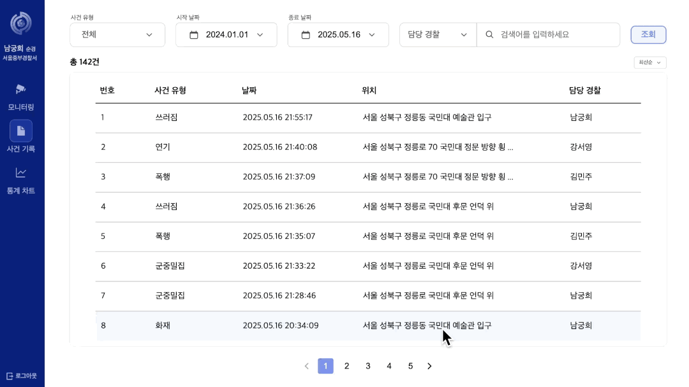
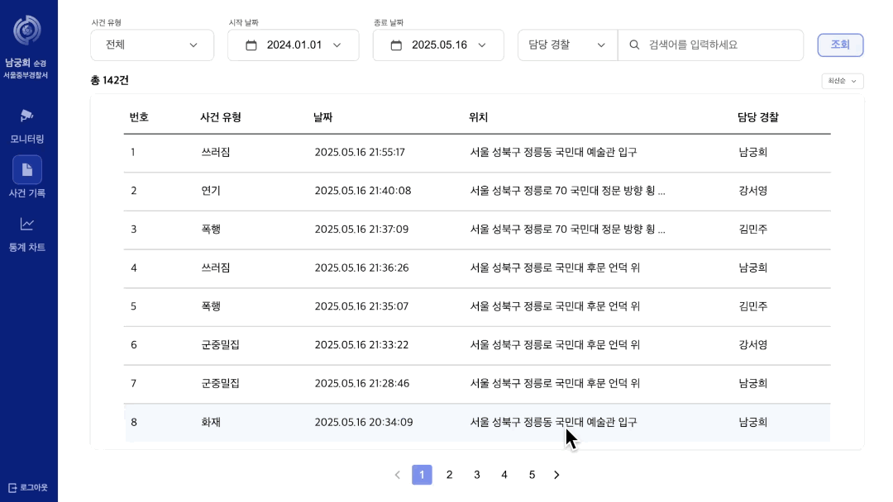

# 👮 순찰의 새로운 기준이 되다, NURINOON

- 소개 페이지 링크: [소개 페이지](https://kookmin-sw.github.io/capstone-2025-24/)
    

<!-- 🌐🎯📍📌 -->

## 🌐 프로젝트 소개

경찰은 치안 관리를 위해 도보 순찰을 강화하고 있으나, 인력 중심 순찰의 한계, 긴급 상황 대응 지체, 신고 의존형 사후 대응 시스템(신고가 없는 사건에 대한 대응 불가) 등의 문제점을 안고 있습니다. 우리는 이러한 문제에 주목하여, AI를 통해 위험 행동을 실시간으로 탐지·분류하고 사건을 즉시 관리할 수 있는 모니터링 시스템, <strong>NURINOON(누리눈)</strong>을 개발하였습니다.

<strong>NURINOON</strong>은 CCTV 영상을 실시간 분석하여 화재, 폭행, 쓰러짐(실신) 등 다양한 위험 상황을 감지하고 사건 유형별로 우선순위를 지정해 경찰의 신속한 대응을 지원합니다. 실시간 스트리밍 기능을 통해 관할 지역 CCTV를 모니터링하며 현장 상황을 즉각적으로 파악할 수 있습니다. 또한 발생한 사건 데이터를 기반으로 경향을 분석하고 시각화하여 순찰 인력 배치 등 치안 전략 수립을 지원합니다.

<strong>NURINOON</strong>은 상시 모니터링을 통해 인력 부담을 줄이고, AI를 활용해 보다 빠른 대응을 가능하게 함으로써 인력 운영의 효율성을 극대화하는 것을 목표로 합니다. 궁극적으로 긴급 상황을 빠르게 인식하고 선제적으로 대응함으로써 공공 안전을 꾸준히 높이는 것을 목표로 합니다.
  

## 🌐 시연 영상

  

## 🌐 기능 소개

### 👁️‍🗨️ AI 기반 실시간 위험 행동 감지

AI를 통해 CCTV 데이터를 실시간으로 분석해 위험 행동을 감지합니다. 폭행, 실신, 흉기난동, 화재, 군중밀집 등 다양한 위험 행동을 감지할 수 있습니다.

### 🚨 위험 행동 분류 및 알림

위험도에 따라 단계를 구분하여 위험 행동 감지 알림을 전송합니다. 1단계 위험은 푸쉬 알림으로, 2단계 위험은 모달창을 통해 위험 상황을 알립니다. 경찰은 상황에 따라 우선순위가 높은 사건부터 해결할 수 있습니다.

### 🚔 출동중인 사건 관리

경찰은 출동중인 사건을 모아서 관리하고 확인할 수 있습니다. 사건 발생 시각, 위치 등의 정보를 제공하며 '영상 확인' 버튼을 통해 위험 행동이 감지된 CCTV 화면을 다시 확인할 수 있습니다.

### 👍 AI 성능 개선을 위한 사건 유형 피드백

사건 종료 시 사건 발생 유무, 위험 유형 매칭률 등을 선택하여 사건 유형 피드백을 진행합니다. 피드백이 반영된 데이터를 재학습시켜 오탐률을 줄이고 정확도를 높일 수 있습니다.

### 📝 사건 기록 조회

경찰이 종결된 사건을 모아서 확인할 수 있도록 '사건 기록 조회' 기능을 제공합니다.

### 📊 통계 차트 제공

누적된 사건 데이터를 기반으로 시간대별, 장소별, 유형별 등 다양한 통계 그래프를 제공합니다. 경찰은 그래프를 통해 사건 경향성을 파악할 수 있으며, 지도의 클러스터링 기능을 통해 사건 다발 지역을 쉽게 인식할 수 있습니다.
  

## 🌐 화면 소개

<table>
  <tr>
    <th style="width: 200px; text-align: left;">기능</th>
    <th style="text-align: center;">시연 화면</th>
  </tr>
  <tr>
    <td>CCTV 모니터링</td>
    <td align="center">
      
    </td>
  </tr>
  <tr>
    <td>실시간 위험행동 감지 알림</td>
    <td align="center">
       
      
    </td>
  </tr>
  <tr>
    <td>출동중인 사건 관리</td>
    <td align="center">
      
    </td>
  </tr>
  <tr>
    <td>AI 성능 개선을 위한 피드백</td>
    <td align="center">
      
    </td>
  </tr>
  <tr>
    <td>사건 기록 조회</td>
    <td align="center">
      
    </td>
  </tr>
  <tr>
    <td>사건 통계 차트</td>
    <td align="center">
      
    </td>
  </tr>
</table>

  

## 🌐 시스템 아키텍처

<!-- 아키텍처 사진 -->

 
    

    
    

  

## 🌐 팀원

<table>
    <tr align="center">
      <td style="min-width: 100px;">
            <a href="https://github.com/hummingbbird">
              
               
              <b>이채영</b>
            </a>
        </td>
      <td style="min-width: 100px;">
            <a href="https://github.com/seo0o519">
              
               
              <b>강서영</b>
            </a>
        </td>
      <td style="min-width: 100px;">
            <a href="https://github.com/HeeNamgoong">
              
               
              <b>남궁희</b>
            </a>
        </td>
      <td style="min-width: 100px;">
            <a href="https://github.com/hyni03">
              
               
              <b>김은지</b>
            </a>
        </td>
        <td style="min-width: 100px;">
            <a href="https://github.com/mjk25">
              
               
              <b>김민주</b>
            </a>
        </td>
        <td style="min-width: 100px;">
            <a href="https://github.com/justpers">
              
               
              <b>김예향</b>
            </a>
        </td>
    </tr>
    <tr align="center">
      <td>
            TL, Frontend  
      </td>
       <td>
            Frontend  
      </td>
       <td>
            Frontend 
      </td>
      <td>
            Backend  
      </td>
      <td>
            Backend  
      </td>
      <td>
            AI  
      </td>
    </tr>
</table>
  

## 🌐 기술 스택

### 💄 Frontend

| 역할                     | 종류                                                                                                                                                                                                                      |
| ------------------------ | ------------------------------------------------------------------------------------------------------------------------------------------------------------------------------------------------------------------------- |
| **Library**              |                                                                                                                         |
| **Programming Language** |                                                                                                          |
| **UI Component Library** |                                                                                                                               |
| **Styling**              |                                                                                  |
| **Formatting**           |   |
| **Package Manager**      |                                                                                                                        |
| **Deployment**           |                                                                                                                      |

 

### 🚀 Backend

| 역할                     | 종류                                                                                                                                                                                                             |
| ------------------------ | ---------------------------------------------------------------------------------------------------------------------------------------------------------------------------------------------------------------- |
| **Programming Language** |                                                                                                                |
| **Framework**            |                                                                                                |
| **Build Tool**           |                                                                                                             |
| **API**                  |                                                                                                             |
| **Database**             |                                                                                                 |
| **Storage**              |                                                                                                           |
| **Message Queue**        |                                                                                             |
| **Deployment**           |   |
| **CI/CD**                |                                                                                      |

 

### 🤖 AI Server

| 역할                     | 종류                                                                                                                                                                                                                 |
| ------------------------ | -------------------------------------------------------------------------------------------------------------------------------------------------------------------------------------------------------------------- |
| **Programming Language** |                                                                                                                 |
| **Framework**            |   |
| **Video Processiog**     |                                                                                                                 |

 

### 🖥️ Common

| 역할                | 종류                                                                                                                                                                                                     |
| ------------------- | -------------------------------------------------------------------------------------------------------------------------------------------------------------------------------------------------------- |
| **Communication**   |   |
| **Version Control** |         |

  

## 🌐 제출 서류

<!-- 수행계획서 -->
<!-- 중간보고서 -->
<!-- 중간발표자료 -->
<!-- 중간시연영상 -->
<!-- 최종보고서 -->
<!-- 최종발표자료 -->
<!-- 최종시연연영상 -->
